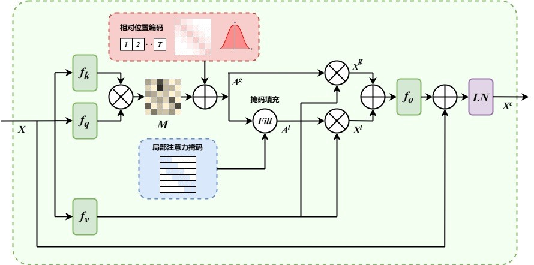
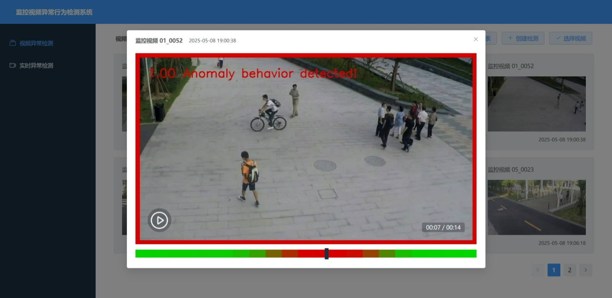
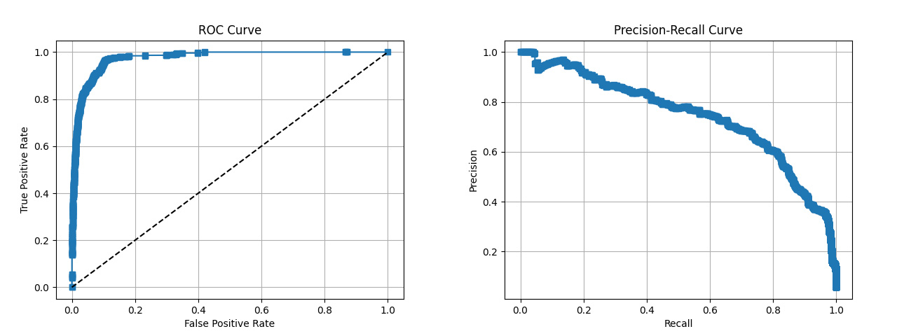

# Surveillance

*<u>v1.0.0 新变化：初次发布项目源代码。</u>*

## 项目简介

本项目基于对现有研究方法的改进和集成，构建了一种使用片段级标签的视频异常检测方法，同时在此基础上构建了一套面向监控视频的异常行为检测系统，实现了针对已有监控视频的异常检测和针对监控视频流的实时检测功能。

### 模型结构

本项目的模型结构主要参考了 [这篇论文](https://arxiv.org/abs/2306.14451)。首先将原始视频分割成 16 帧彼此不重叠的片段，使用预训练的 SlowFast 网络提取特征，随后将提取的特征序列降维后输入注意力模块进行上下文建模，最后输入时序卷积分类器模块得到每个片段的异常得分。


注意力模块利用一种可学习的相对位置编码表示不同视频片段间的相对位置信息，分别计算全局注意力矩阵和局部注意力矩阵。通过对全局注意力值和局部注意力值的加权融合，实现同时对全局和局部的上下文关系进行建模。



在模型的最后，本项目还采取了一种对于异常得分序列的平滑策略，通过抑制异常得分序列中的突变值，减弱瞬时噪声对模型预测结果的影响。

### 训练策略

本项目将视频异常检测任务视为时间维度上的分割问题，模型的目标是在时间轴上分割出异常行为发生的区域，采用二元交叉熵和 Dice 系数损失的组合形式构建损失函数，同时针对 Dice 系数在正常样本上损失过度放大的问题作了相应的改进。

本项目使用 [ShanghaiTech](https://svip-lab.github.io/dataset/campus_dataset.html) 数据集训练模型，数据集按照类别平衡的准则重新划分，划分后训练集包含 238 个视频，测试集包含 199 个视频。使用片段级标签进行训练，采用 10-crops 增强策略。

### 系统设计

基于已有视频的异常行为检测过程首先将原始视频切分成不重叠的视频片段，对于每个片段利用特征提取器提取特征构成特征序列。随后对特征序列进行异常检测，得到序列中每个片段的异常概率。

基于实时视频流的异常行为检测分别初始化一个视频帧队列和一个视频特征队列，同时分别限制两个队列的最大容量。首先从视频流中取出当前帧添加到视频帧队列尾部。若视频帧队列已满，则使用视频特征提取器对视频帧队列构成的视频片段进行特征提取，将提取得到的特征向量添加到视频特征队列，同时清空视频帧队列。随后对视频特征队列构成的视频特征序列进行异常检测，取最后一个片段的输出作为当前的异常概率。

本项目异常行为检测模型使用 [ONNX Runtime](https://onnxruntime.ai/) 部署推理。数据库基于 [MongoDB](https://www.mongodb.com/)，用于持久化存储视频异常检测结果记录和实时异常检测会话信息。服务端基于 [Flask](https://flask.palletsprojects.com/en/stable/) 构建，负责处理来自客户端的异常检测请求并运行实时异常检测会话。客户端基于 [Vue3](https://cn.vuejs.org/) 和 [Element-Plus](https://element-plus.org/zh-CN/) 构建，使用 [Nginx](https://nginx.org/en/) 进行服务端和客户端的反向代理。

## 效果展示



## 性能评估

### 检测精度指标

本项目采用 ROC 曲线下面积 (AUC) 和 P-R 曲线下面积 (AP) 作为模型性能的评估指标。下面给出当前训练得到的最优模型检测精度指标。

| 数据集                                                                    | AUC (%) | AP (%) |
|:----------------------------------------------------------------------:|:-------:|:------:|
| [ShanghaiTech](https://svip-lab.github.io/dataset/campus_dataset.html) | 97.49   | 74.35  |

下面展示模型在 [ShanghaiTech](https://svip-lab.github.io/dataset/campus_dataset.html) 数据集下的 ROC 曲线图和 PR 曲线图。



此外，本项目在正常视频样本上引入不同阈值下的误报率 (FAR) ，在异常视频样本上引入不同阈值下预测异常区间和真实异常区间的交并比 (IoU) 作为额外的评估指标。

| 数据集                                                                    | FAR @ 0.2 (%) | FAR @ 0.3 (%) | FAR @ 0.4 (%) | FAR @ 0.5 (%) |
|:----------------------------------------------------------------------:|:-------------:|:-------------:|:-------------:|:-------------:|
| [ShanghaiTech](https://svip-lab.github.io/dataset/campus_dataset.html) | 2.55          | 1.77          | 1.45          | 1.17          |

| 数据集                                                                    | IoU @ 0.2 (%) | IoU @ 0.3 (%) | IoU @ 0.4 (%) | IoU @ 0.5 (%) |
|:----------------------------------------------------------------------:|:-------------:|:-------------:|:-------------:|:-------------:|
| [ShanghaiTech](https://svip-lab.github.io/dataset/campus_dataset.html) | 59.37         | 63.11         | 63.39         | 62.40         |

### 计算效率指标

本项目采用参数量 (Mparams) 和计算量 (MFLOPS) 作为模型计算效率的评估指标，其中计算量以长度为 16 的视频特征序列进行计算，以上数据均不包含预训练特征提取器部分。

| 参数量 (Mparams) | 计算量 (MFLOPS) |
|:-------------:|:------------:|
| 0.69          | 11.05        |

## 使用说明

### 环境搭建

首先需要安装本项目依赖的各种库和工具包。

```shell-session
pip install -r requirements.txt
```

### 数据集构建

本项目的训练数据集格式如下，分为训练集和验证集，如要使用 [ShanghaiTech](https://svip-lab.github.io/dataset/campus_dataset.html) 数据集进行训练，在[这里](https://github.com/jx-zhong-for-academic-purpose/GCN-Anomaly-Detection/tree/master/ShanghaiTech_new_split) 可以找到本项目使用的数据集划分方案。

```shell-session
datasets/
├── train/
│   ├── inputs/
│   │   ├── xxx.npy
│   │   ├── xxx.npy
│   │   └── ...
│   ├── labels/
│   │   ├── xxx.npy
│   │   ├── xxx.npy
│   │   └── ...
│   └── annotations.json
└── valid/
    ├── inputs/
    │   ├── xxx.npy
    │   ├── xxx.npy
    │   └── ...
    ├── labels/
    │   ├── xxx.npy
    │   ├── xxx.npy
    │   └── ...
    └── annotations.json
```

其中 annotations.json 为所在数据集划分的标注文件。annotations.json 文件中的每一行 JSON 格式数据表示一个样本的信息，其中各字段及其描述如下。

| 字段名   | 字段描述                                                |
|:-----:|:---------------------------------------------------:|
| input | 视频样本输入 SlowFast 特征数据文件路径，相对于 annotations.json 所在路径。 |
| label | 视频样本标签文件路径，相对于 annotations.json 所在路径。               |

此外，annotations.json 文件中的样本数据必须保持顺序以确保评估结果正确，本项目提供了默认的文件可供参考。

数据集中 inputs 目录下为视频样本的特征数据， 其形状为 (视频片段数，特征维度) 。labels 目录下为视频样本的标签数据，在训练集中该文件为片段级标签数据，在验证集中为帧级标签数据。数据文件均使用 [NumPy](https://numpy.org/) 数组格式。

本项目使用 [PyTorchVideo](https://github.com/facebookresearch/pytorchvideo) 中提供的 [SlowFast_8x8 R50 Detection](https://dl.fbaipublicfiles.com/pytorchvideo/model_zoo/ava/SLOWFAST_8x8_R50_DETECTION.pyth) 模型提取视频特征，构建数据集需满足上述要求，也可以使用我提取的视频特征和标签，请留下电子邮箱地址。

### 模型训练

准备好数据集后，运行 train.py 开始训练，训练和验证默认的配置文件为 configs/config.toml，其中各个字段的描述如下。

| 字段名                  | 字段描述                                                               |
|:--------------------:|:------------------------------------------------------------------:|
| device               | 设备名称，与 PyTorch 的设备名称保持一致。                                          |
| seed                 | 随机数种子。                                                             |
| num-epochs           | 训练迭代次数。                                                            |
| num-workers          | 训练及评估数据加载进程数。                                                      |
| batch-size           | 训练数据批大小。                                                           |
| group-size           | 增强样本组大小，如采用 10-crops 增强，其值应当为 10，以此类推。                             |
| learning-rate        | 模型训练学习率。                                                           |
| weight-decay         | 模型训练权重衰减。                                                          |
| log-interval         | 日志输出频率。                                                            |
| alpha                | 全局注意力输出和局部注意力输出的融合权重。                                              |
| attention-window     | 局部注意力窗口大小。                                                         |
| smoothing-window     | 异常得分序列平滑窗口大小。                                                      |
| load-checkpoint      | 是否加载 checkpoint 继续训练，若为 true 则从 load-path 加载模型权重，反之则使用初始化模型权重开始训练。 |
| load-checkpoint-path | 训练初始模型的加载路径，同时也为待评估模型加载路径。                                         |
| best-checkpoint-path | 训练中当前验证集最优模型保存路径。                                                  |
| last-checkpoint-path | 训练中最后一次训练模型保存路径。                                                   |

### 模型评估

模型训练完成后，运行 eval.py 对模型进行评估，分别计算模型在验证集上的各种评估指标。默认的配置文件及字段描述同上。

### 启动服务端程序

服务端的模型推理模块位于 inferences 目录下，如果使用自己的数据集进行训练，首先需要将训练好的模型以及使用的特征提取器转换为 ONNX 格式放入 inferences/models 目录下。同时我使用的模型文件也将在 Release 中公布。

推理模块默认的配置文件为 inferences/configs/config.toml，其中各个字段的描述如下。

| 字段名                   | 字段描述                                      |
|:---------------------:|:-----------------------------------------:|
| precision             | 模型推理精度，取值为 "fp32" (单精度) 和 "fp16" (半精度) 。  |
| providers             | 模型推理 ONNX Runtime Execution Providers 列表。 |
| extraction-model-path | 视频特征提取模型加载路径。                             |
| detection-model-path  | 视频异常检测模型加载路径。                             |
| segment-width         | 视频片段画面缩放目标宽度。                             |
| segment-height        | 视频片段画面缩放目标高度。                             |
| segment-length        | 视频片段帧数。                                   |
| history-length        | 实时检测历史片段数。                                |
| smoothing-window      | 异常得分序列平滑窗口大小。                             |
| crop-x1               | 视频画面剪裁边界框 x1 坐标值。                         |
| crop-x2               | 视频画面剪裁边界框 x2 坐标值。                         |
| crop-y1               | 视频画面剪裁边界框 y1 坐标值。                         |
| crop-y2               | 视频画面剪裁边界框 y2 坐标值。                         |
| normalization-std     | 视频画面数据正则化标准差，其值不同的特征提取器有所不同。              |
| normalization-mean    | 视频画面数据正则化均值，其值不同的特征提取器有所不同。               |
| anomaly-threshold     | 异常检测得分报警阈值。                               |
| anomaly-border        | 异常报警红色边框宽度。                               |
| anomaly-prompt        | 异常报警提示信息文本。                               |
| capture-interval      | 实时异常检测实时视频帧获取间隔，建议设置为较小值以确保读取的视频画面为最新的画面。 |
| prepare-interval      | 实时视频帧准备间隔，需要与模型训练数据的视频帧率保持一致。             |
| predict-interval      | 实时推理程序执行最小间隔，可根据需要进行调整。                   |

服务器模块位于 servers 目录下，其中 videos 目录用于存储检测结果视频，covers 目录用于存储视频封面，以上目录如果不存在请先创建。默认的配置文件为 servers/configs/config.toml，其中各个字段的描述如下。

| 字段名               | 字段描述                            |
|:-----------------:|:-------------------------------:|
| db-connection-uri | 数据库服务地址。                        |
| db-connection-max | 数据库连接池最大连接数。                    |
| video-speed       | 服务端接受的视频帧率。                     |
| video-width       | 服务端接受的视频画面宽度。                   |
| video-height      | 服务端接受的视频画面高度。                   |
| cover-width       | 视频封面宽度，此值可小于视频画面宽度以节约资源并提升加载速度。 |
| cover-height      | 视频封面高度，此值可小于视频画面高度以节约资源并提升加载速度。 |
| remove-interval   | 文件延迟删除任务执行间隔。                   |
| frames-interval   | 实时检测视频结果返回间隔。                   |

准备好模型文件，安装配置并启动 [MongoDB](https://www.mongodb.com/) 数据库服务后，根据实际情况修改上述配置信息，运行以下命令以启动服务端程序。

```shell-session
python -m flask --app servers.server:app run --host=0.0.0.0 --port=8080
```

### 启动客户端程序

客户端程序位于 clients 目录下，在此目录下安装所需要的依赖软件包。

```shell-session
npm install
```

运行以下命令以快速启动开发服务器。

```shell-session
npm run dev
```

也可以将项目打包后使用服务器运行。

```shell-session
npm run build
```

此外还需要安装配置并启动 [Nginx](https://nginx.org/en/) 服务进行后端服务和前端服务之间的反向代理，其中后端接口的资源路径均具有 /api 前缀。
